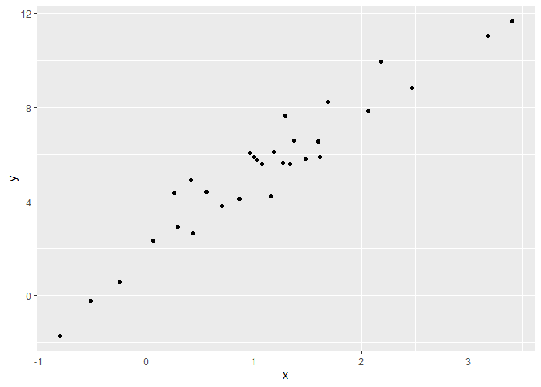

Writing Functions
================
Kylie Wheelock Riley
10/24/2019

## Writing Functions:

To write a function, you first need to start with smaller pieces of code
that work outside of a function.

The chunk below takes a sample from a normal distribution and then
computes the vector of Z scores for the sample.

``` r
x = rnorm(n = 30, mean = 4, sd = 2.3)
x_again = rnorm(n = 30, mean = 6, sd = .3)

(x - mean(x)) / sd(x)
```

    ##  [1] -0.767120446  0.109493425 -0.993470503  1.637039863  0.267334741
    ##  [6] -0.977065475  0.438222871  0.709719461  0.533829741 -0.419692475
    ## [11]  1.546684110  0.332624325 -0.761479160 -2.485776741  1.128069748
    ## [16] -0.137851865 -0.106748415  0.932105430  0.799422547  0.553437533
    ## [21]  0.905205442  0.757128408 -0.008541293 -2.241925304  0.581490604
    ## [26] -0.149966223 -0.257816586 -1.680744021 -0.606639531  0.363029790

``` r
(x_again - mean(x_again)) / sd(x_again)
```

    ##  [1]  1.5413954 -0.2961850  0.3204956 -0.2345965 -1.8983946 -0.6887392
    ##  [7] -0.6627062 -0.2415224  1.2161757  0.7926368 -0.3738088 -0.4855096
    ## [13]  0.7093845  0.5329776 -1.0329536 -1.0565157  0.2914637  0.7993727
    ## [19] -0.3082034  0.9409190  0.3336151 -0.9364778  0.2619634 -1.5869527
    ## [25]  1.6348722  2.3231173 -0.6286716 -1.4797904  0.5493942 -0.3367558

If I want to repeat this process for lots of samples, I might want to
have a function that takes the sample as an argument, computes the
vector of Z scores in the body, and returns the result. I define such a
function below.

``` r
z_scores = function(x_arg) {
  ##adding conditional formatting so the function only works on the type of data you want
    if (!is.numeric(x_arg)) {
    stop("Argument x should be numeric")
  } else if (length(x_arg) == 1) {
    stop("Z scores cannot be computed for length 1 vectors")
  }
  z = (x_arg - mean(x_arg)) / sd(x_arg)
  z
  
}

z_scores(x)
```

    ##  [1] -0.767120446  0.109493425 -0.993470503  1.637039863  0.267334741
    ##  [6] -0.977065475  0.438222871  0.709719461  0.533829741 -0.419692475
    ## [11]  1.546684110  0.332624325 -0.761479160 -2.485776741  1.128069748
    ## [16] -0.137851865 -0.106748415  0.932105430  0.799422547  0.553437533
    ## [21]  0.905205442  0.757128408 -0.008541293 -2.241925304  0.581490604
    ## [26] -0.149966223 -0.257816586 -1.680744021 -0.606639531  0.363029790

I can try this with a few samples and confirm that it works. I should
also try to think of ways this code might break; the attempts below try
a variety of inputs to see what happens.

``` r
z_scores(x_arg = y)
```

    ## Error in z_scores(x_arg = y): object 'y' not found

``` r
##figure out what y is after class

z_scores(x = 3)
```

    ## Error in z_scores(x = 3): Z scores cannot be computed for length 1 vectors

``` r
#does not work
z_scores("my name is jeff")
```

    ## Error in z_scores("my name is jeff"): Argument x should be numeric

``` r
#does not work
z_scores(x = c(TRUE, TRUE, FALSE, TRUE))
```

    ## Error in z_scores(x = c(TRUE, TRUE, FALSE, TRUE)): Argument x should be numeric

``` r
#does work
z_scores(x = iris)
```

    ## Error in z_scores(x = iris): Argument x should be numeric

``` r
#does not work
```

## Multiple Outputs:

In some cases it might be better to return the mean and standard
deviation instead of the Z scores. A first option is to store each of
the values in a named list, and to return that list.

``` r
mean_and_sd = function(input_x) {
  
  if (!is.numeric(x_arg)) {
    stop("Argument x should be numeric")
  } else if (length(x_arg) == 1) {
    stop("Cannot be computed for length 1 vectors")
  }
  
 
  mean_input = mean(input_x)
  sd_x = sd(input_x)

  list(
    mean_input = mean(input_x), 
       sd_input = sd(input_x)
  )
}
```

Storing in a data frame (uses tibble instead of list)

``` r
mean_and_sd = function(input_x) {
  
  if (!is.numeric(x_arg)) {
    stop("Argument x should be numeric")
  } else if (length(x_arg) == 1) {
    stop("Cannot be computed for length 1 vectors")
  }
  
 
  mean_input = mean(input_x)
  sd_x = sd(input_x)

  tibble(
    mean_input = mean(input_x), 
       sd_input = sd(input_x)
  )
}
```

In general, either of these will be fine; which one you choose will
depend on what kind of values you want to return, and what you plan to
do with the function itself. If you want to return the original sample
along with the computed values, a list might make sense; if you plan to
run your function a lot and study the results, having a data frame will
make it easier to use other tools.

## Multiple Inputs

I’d like to have a function that takes a given sample size and true
simple linear regression line, simulates data from that model, and
returns the estimated intercept and slope.

``` r
sim_data = tibble(
  x = rnorm(30, mean = 1, sd = 1),
  y = 2 + 3 * x + rnorm(30, 0, 1)
)

ls_fit = lm(y ~ x, data = sim_data)
  
beta0_hat = coef(ls_fit)[1]
beta1_hat = coef(ls_fit)[2]
```

``` r
##plotting the data generated above
sim_data %>% 
  ggplot(aes(x = x, y = y)) +
  geom_point()
```

<!-- -->

Making the function.

``` r
sim_regression = function(n, beta0 = 2, beta1 = 3) {
  
  ##arguments
  sim_data = tibble(
    x = rnorm(n, mean = 1, sd = 1),
    y = beta0 + beta1 * x + rnorm(n, 0, 1)
  )
  
  ##body
  ls_fit = lm(y ~ x, data = sim_data)
  
  ##return
  tibble(
    beta0_hat = coef(ls_fit)[1],
    beta1_hat = coef(ls_fit)[2]
  )
}

sim_regression(30)
```

    ## # A tibble: 1 x 2
    ##   beta0_hat beta1_hat
    ##       <dbl>     <dbl>
    ## 1      2.44      2.70

``` r
sim_regression(300)
```

    ## # A tibble: 1 x 2
    ##   beta0_hat beta1_hat
    ##       <dbl>     <dbl>
    ## 1      1.94      2.99

\#\#Revisiting past examples Scraped Amazon Napoleon Dynamite reviews

``` r
read_page_reviews <- function(url) {
  
  h = read_html(url)
  
  review_titles = h %>%
    html_nodes("#cm_cr-review_list .review-title") %>%
    html_text()
  
  review_stars = h %>%
    html_nodes("#cm_cr-review_list .review-rating") %>%
    html_text() %>%
    str_extract("\\d") %>%
    as.numeric()
  
  review_text = h %>%
    html_nodes(".review-data:nth-child(4)") %>%
    html_text()
  
  tibble(
    title = review_titles,
    stars = review_stars,
    text = review_text
  )
}
```

Next we’ll use this to read in reviews from a few pages and combine the
results.

``` r
url_base = "https://www.amazon.com/product-reviews/B00005JNBQ/ref=cm_cr_arp_d_viewopt_rvwer?ie=UTF8&reviewerType=avp_only_reviews&sortBy=recent&pageNumber="
vec_urls = str_c(url_base, 1:5)

dynamite_reviews = bind_rows(
  read_page_reviews(vec_urls[1]),
  read_page_reviews(vec_urls[2]),
  read_page_reviews(vec_urls[3]),
  read_page_reviews(vec_urls[4]),
  read_page_reviews(vec_urls[5])
)

dynamite_reviews
```

    ## # A tibble: 50 x 3
    ##    title                               stars text                          
    ##    <chr>                               <dbl> <chr>                         
    ##  1 "Awesome\n            "                 5 Format: Prime VideoVerified P~
    ##  2 "Gotta watch it!\n            "         5 Format: Prime VideoVerified P~
    ##  3 "Great movie\n            "             5 Format: Blu-rayVerified Purch~
    ##  4 "Duh\n            "                     5 Format: Prime VideoVerified P~
    ##  5 "Great video\n            "             5 Format: DVDVerified Purchase  
    ##  6 "Give me some of your tots\n      ~     5 Format: Prime VideoVerified P~
    ##  7 "Nostalgic\n            "               5 Format: Prime VideoVerified P~
    ##  8 "Make you giggle type movie\n     ~     5 Format: Blu-rayVerified Purch~
    ##  9 "This movie is so stupid.\n       ~     5 Format: Prime VideoVerified P~
    ## 10 "Hilarious\n            "               5 Format: Prime VideoVerified P~
    ## # ... with 40 more rows

Loading LoTR data: In tidy data, we broke the “only copy code twice”
rule when we used the code below to process the LoTR words data:

``` r
fellowship_ring = readxl::read_excel("./data/LotR_Words.xlsx", range = "B3:D6") %>%
  mutate(movie = "fellowship_ring")

two_towers = readxl::read_excel("./data/LotR_Words.xlsx", range = "F3:H6") %>%
  mutate(movie = "two_towers")

return_king = readxl::read_excel("./data/LotR_Words.xlsx", range = "J3:L6") %>%
  mutate(movie = "return_king")

lotr_tidy = bind_rows(fellowship_ring, two_towers, return_king) %>%
  janitor::clean_names() %>%
  gather(key = sex, value = words, female:male) %>%
  mutate(race = str_to_lower(race)) %>% 
  select(movie, everything()) 
```

## Learning Assessment 1:

Try to write a function that can be used to abstract the data loading
and cleaning process. Use this function to recreate the tidied LoTR
dataset.

``` r
lotr_load_and_tidy = function(path, range, movie_name) {
  
  df = readxl::read_excel(path, range = range) %>%
    janitor::clean_names() %>%
    gather(key = sex, value = words, female:male) %>%
    mutate(race = str_to_lower(race),
           movie = movie_name)
  
  df
  
}

lotr_tidy = 
  bind_rows(
    lotr_load_and_tidy("./data/LotR_Words.xlsx", "B3:D6", "fellowship_ring"),
    lotr_load_and_tidy("./data/LotR_Words.xlsx", "F3:H6", "two_towers"),
    lotr_load_and_tidy("./data/LotR_Words.xlsx", "J3:L6", "return_king")) %>%
  select(movie, everything()) 
```

## Functions as arguments

As a quick example, suppose we wanted to get a sense of how similar or
different values in a vector are to each other. There are lots of ways
to measure this – variance, standard deviation, range, inter-quartile
range – and some are more appropriate in some cases than in others. The
function below allows you to input a vector and a function, and returns
the result of applying the specified function to the vector input.

``` r
x = rnorm(25, 0, 1)

my_summary = function(x, summ_func) {
  summ_func(x)
}

my_summary(x, sd)
```

    ## [1] 1.02038

``` r
## [1] 0.8988712
my_summary(x, IQR)
```

    ## [1] 1.51822

``` r
## [1] 1.271572
my_summary(x, var)
```

    ## [1] 1.041175

``` r
## [1] 0.8079694
```
